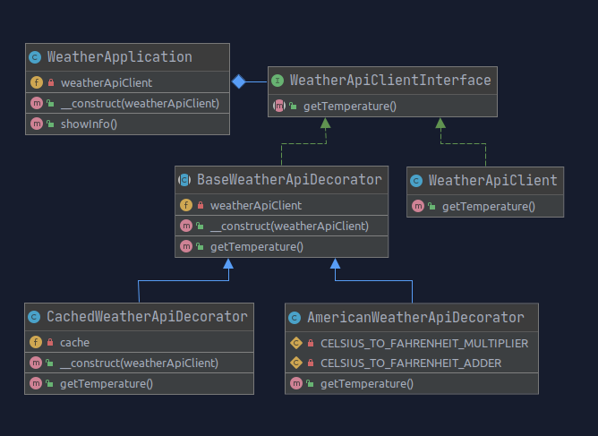

### Examples of design patterns in PHP 7.4

#### Weather

Weather Api client that can be wrapped using Decorator pattern for cashing or unit conversion.

pattern: **Decorator**

Example use case: `public/index.php`

#### Environment

You can use docker container with php 7.4 if you wish:

`cd <<project directory>>`

install dependencies (phpunit), configure autoloading: `docker-compose run php-dev composer install`

run project: `docker-compose run php-dev php public/index.php`

run tests: `docker-compose run php-dev php vendor/phpunit/phpunit/phpunit --color=always test/WeatherTest.php`
